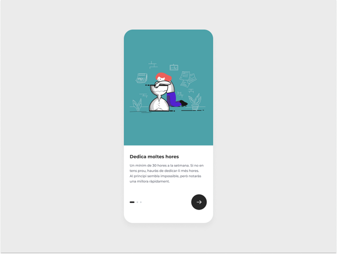

 

**Description** 📋

This repository contains a React application showcasing an interactive onboarding experience with three slides. Each slide provides valuable tips and advice to enhance your programming learning journey. Built with TypeScript for strong typing and modern front-end technologies, this project offers a practical way to explore core React concepts.

**Technologies Used** 🛠️

React : Declarative JavaScript library for building user interfaces
TypeScript: Superset of JavaScript adding static typing and improved code maintainability
Vite: Modern build tool for fast development and bundling
Tailwind CSS: Utility-first CSS framework for rapid styling
Framer Motion: Declarative animation library for smooth and engaging user interactions

**Installation** 🔧 

# 1. Clone the Repository:

Bash
git clone https://github.com/your-username/your-repo-name.git

# 2. Install Dependencies:

Navigate to the project directory and run:

Bash
npm install

# 3. Run the Development Server:

Start the development server with hot module replacement for seamless updates:

Bash
npm run dev

A browser window will automatically open once you click on the IP URL displayed.

*********************************************************************************************************************************************************************************************************************

**Usage** ⚙️

Click the "next" or "previous" arrows to navigate between the three onboarding slides. Each slide offers a helpful message or tip related to efficient programming learning.

**Contributing** 🖇️

This is a repo created to learn, but feel free to fork this repository, make changes, and create pull requests for any improvements or enhancements. Please adhere to the project's coding style and best practices.

**Benefits of Using This Project** 🚀

Interactive Onboarding: Guides users through key concepts with visually engaging animations.
TypeScript Advantages: Enhances code readability, maintainability, and type safety.
Modern Technologies: Leverages the power of current front-end tools to deliver a smooth user experience.
Practice Environment: Provides a sandbox to experiment with core React concepts.

